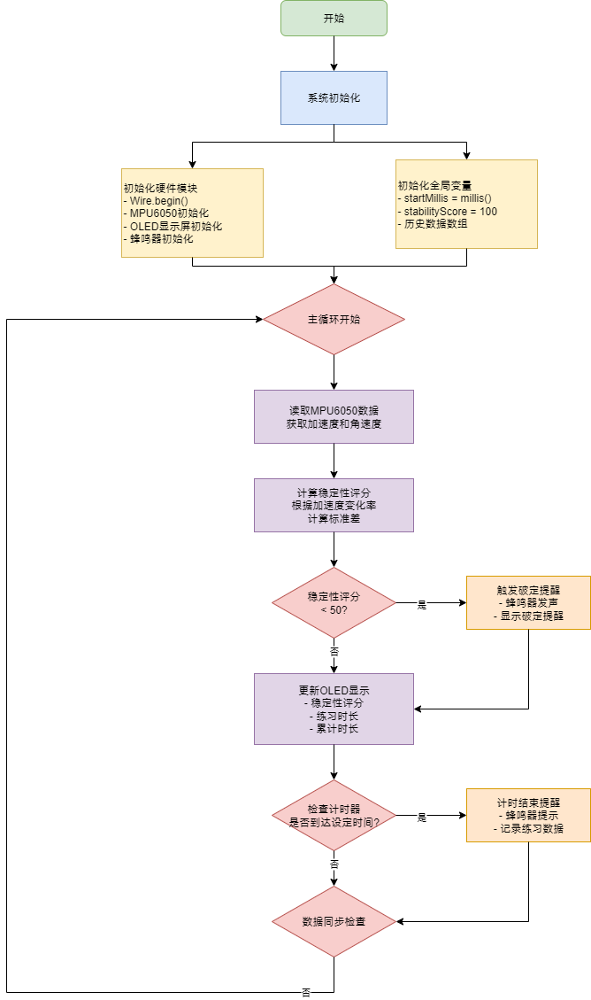

# 气定神闲仪 (Zen-Motion Meter)

基于ESP32-C3 SuperMini的武术稳定性训练设备

## 项目概述

气定神闲仪是一款专为武术练习者设计的智能训练设备，基于ESP32-C3 SuperMini开发，通过实时监测身体稳定性，提供科学的训练反馈和数据记录。设备特别适用于站桩、马步、太极等传统武术动作的练习。

### 技术特色
- **多平台支持**: 同时支持ESP32-C3 SuperMini和ESP32 DevKit
- **中文界面**: 完整的中文字符显示支持，符合国内用户习惯
- **模块化架构**: 清晰的模块分离，便于维护和扩展
- **智能诊断**: 完整的硬件自检和故障诊断系统
- **精确显示**: 优化的OLED布局，所有元素精确居中对齐

## 主要功能

### 核心功能
- **实时稳定性评分**: 基于MPU6050传感器的6轴运动检测，实时计算稳定性评分(0-100分)
- **破定提醒**: 当稳定性低于设定阈值时，通过蜂鸣器发出提醒
- **练习时长记录**: 自动记录每次练习的时长和累计时长
- **数据统计**: 按天统计练习数据，支持7天历史数据查看
- **智能校准**: 自动传感器校准功能，确保测量精度

### 系统功能
- **开机动画**: 4秒品牌展示和系统初始化进度显示
- **主菜单导航**: 直观的中文菜单系统，支持四大功能模块
- **电源管理**: 智能休眠模式，电池电量监控和低电量提醒
- **硬件诊断**: 完整的I2C扫描、GPIO测试、内存监控
- **数据持久化**: EEPROM存储，断电数据不丢失
- **多环境支持**: 智能引脚配置，支持不同ESP32开发板

## 硬件配置

### 支持的开发板
- **ESP32-C3 SuperMini** (主要支持)
- **ESP32 DevKit** (兼容支持)

### 主要组件
- **主控**: ESP32-C3 SuperMini / ESP32 DevKit
- **传感器**: MPU6050 (6轴陀螺仪+加速度计)
- **显示**: 0.96寸OLED显示屏 (SSD1306驱动，I2C地址0x3C)
- **交互**: 单按钮控制 (支持单击/双击/长按)
- **反馈**: 蜂鸣器 (可调频率和音量)
- **电源**: 锂电池供电 (支持电量监控)

### 引脚配置

#### ESP32-C3 SuperMini
```
I2C SDA: GPIO 8
I2C SCL: GPIO 9
按钮: GPIO 3 (按下时HIGH，无内部上拉)
蜂鸣器: GPIO 4
LED指示灯: GPIO 2
```

#### ESP32 DevKit
```
I2C SDA: GPIO 21 (默认I2C引脚)
I2C SCL: GPIO 22 (默认I2C引脚)
按钮: GPIO 2 (按下时HIGH，无内部上拉)
蜂鸣器: GPIO 15
LED指示灯: GPIO 4
```

## 软件架构

### 系统架构图
.png)

### 系统流程图


### 模块化设计
- **SensorManager**: 传感器数据采集和稳定性算法
- **DisplayManager**: OLED显示和UI管理，支持中文字符显示
- **InputManager**: 按钮输入处理和蜂鸣器控制
- **DataManager**: 数据存储和会话管理，支持EEPROM持久化
- **PowerManager**: 电源管理和智能休眠控制
- **DiagnosticUtils**: 硬件诊断和系统监控

### 核心算法
稳定性评分基于以下参数计算：
- 加速度偏差 (与重力1g的偏差)
- 角速度幅值 (陀螺仪数据)
- 历史数据方差 (滑动窗口统计)
- 综合加权评分 (0-100分制)

### 状态机设计
系统采用完整的状态机管理：
- **开机动画状态**: 4秒品牌展示和系统初始化
- **主菜单状态**: 功能选择和导航
- **练习状态**: 实时监测和数据记录
- **设置状态**: 系统参数配置
- **校准状态**: 传感器校准和验证

## 快速开始

### 硬件连接
1. **ESP32-C3 SuperMini连接**:
   ```
   MPU6050 -> ESP32-C3
   VCC -> 3.3V, GND -> GND
   SDA -> GPIO 8, SCL -> GPIO 9

   OLED -> ESP32-C3
   VCC -> 3.3V, GND -> GND
   SDA -> GPIO 8, SCL -> GPIO 9 (与MPU6050共享I2C总线)

   按钮 -> GPIO 3 (另一端接GND)
   蜂鸣器 -> GPIO 4 (正极)，GND (负极)
   ```

2. **ESP32 DevKit连接**:
   ```
   I2C设备连接到GPIO 21(SDA)和GPIO 22(SCL)
   按钮连接到GPIO 2，蜂鸣器连接到GPIO 15
   ```

### 软件安装
```bash
# 1. 安装PlatformIO (在VS Code中安装PlatformIO扩展)

# 2. 克隆项目
git clone <repository-url>
cd zenMotionMeter

# 3. 编译和上传 (ESP32-C3 SuperMini)
pio run -e esp32-c3-supermini --target upload

# 4. 监视串口输出
pio device monitor --baud 115200
```

### 首次使用
1. 上电后观看开机动画(4秒)
2. 进入主菜单，选择"传感器校准"
3. 将设备放置在平稳表面，等待校准完成
4. 返回主菜单，选择"开始练习"
5. 佩戴设备开始练习

## 使用说明

### 开机流程
1. **开机动画**: 设备启动后显示4秒开机动画，展示"气定神闲仪"品牌和初始化进度
2. **主菜单**: 动画完成后自动进入主菜单，显示四个功能选项

### 基本操作
- **单击**: 菜单选择确认/开始练习/暂停恢复
- **长按(3秒)**: 功能切换/停止练习/返回主菜单
- **双击**: 快速传感器校准(在主菜单中)

### 主菜单功能
1. **开始练习**: 进入练习模式，实时监测稳定性
2. **历史数据**: 查看7天内的练习统计数据
3. **系统设置**: 调整设备参数和查看系统状态
4. **传感器校准**: 校准MPU6050传感器，确保测量精度

### 显示界面
- **开机动画页**: 品牌展示和系统初始化进度
- **主菜单页**: 四大功能模块选择
- **练习页面**: 显示实时稳定性评分、练习时长、累计时长
- **统计页面**: 显示今日和历史练习统计数据
- **设置页面**: 显示系统设置和电池状态
- **校准页面**: 显示传感器校准进度和状态

### 练习流程
1. 设备开机后观看开机动画(4秒)
2. 进入主菜单，选择"开始练习"
3. 将设备佩戴在腰部(丹田位置)
4. 单击按钮开始练习计时
5. 保持稳定姿势，观察实时评分(0-100分)
6. 听到蜂鸣器提醒时调整姿势(破定提醒)
7. 长按按钮3秒停止练习并返回主菜单

## 开发环境

### 必需工具
- PlatformIO IDE
- ESP32-C3开发环境
- Git

### 依赖库
- MPU6050库 (electroniccats/MPU6050@^1.0.0)
- U8g2库 (olikraus/U8g2@^2.35.19) - 支持中文显示
- Bounce2库 (thomasfredericks/Bounce2@^2.71) - 专业按钮防抖
- Wire库 (I2C通信)
- EEPROM库 (数据存储)

### 编译和上传

#### 支持的开发板环境
- **esp32-c3-supermini**: ESP32-C3 SuperMini (主要环境)
- **esp32-devkit**: ESP32 DevKit (兼容环境)

```bash
# 克隆项目
git clone <repository-url>
cd zenMotionMeter

# ESP32-C3 SuperMini (推荐)
pio run -e esp32-c3-supermini
pio run -e esp32-c3-supermini --target upload

# ESP32 DevKit (兼容)
pio run -e esp32-devkit
pio run -e esp32-devkit --target upload

# 监视串口输出和调试
pio device monitor --baud 115200

# 完整的编译、上传、监视流程
pio run -e esp32-c3-supermini --target upload && pio device monitor --baud 115200
```

### 测试
```bash
# 运行单元测试
pio test

# 运行特定测试
pio test -f test_modules
```

## 配置说明

### 多环境引脚配置

#### ESP32-C3 SuperMini
```cpp
// 引脚配置
#define I2C_SDA_PIN 8
#define I2C_SCL_PIN 9
#define BUTTON_PIN 3
#define BUZZER_PIN 4
#define LED_PIN 2

// 按钮配置
#define BUTTON_PRESSED_STATE HIGH    // 按下时高电平
#define BUTTON_PIN_MODE INPUT        // 无内部电阻
```

#### ESP32 DevKit
```cpp
// 引脚配置
#define I2C_SDA_PIN 21              // ESP32默认I2C引脚
#define I2C_SCL_PIN 22
#define BUTTON_PIN 2
#define BUZZER_PIN 15
#define LED_PIN 4                   // LED指示灯

// 按钮配置
#define BUTTON_PRESSED_STATE HIGH    // 按下时高电平
#define BUTTON_PIN_MODE INPUT        // 不使用内部上拉
```

### 系统配置参数
```cpp
// 稳定性配置
#define STABILITY_THRESHOLD 50      // 破定提醒阈值
#define STABILITY_WINDOW_SIZE 20    // 滑动窗口大小

// 时间配置
#define DEFAULT_PRACTICE_TIME 300000  // 默认5分钟
#define SLEEP_TIMEOUT 300000         // 5分钟无操作休眠
```

### 系统设置
可通过菜单界面调整的设置：
- 稳定性阈值 (30-80)
- 声音开关
- 显示亮度
- 默认练习时长
- 自动休眠开关

## 数据格式

### 练习会话数据
```cpp
struct PracticeSession {
  unsigned long startTime;     // 开始时间
  unsigned long duration;      // 持续时间
  float avgStability;          // 平均稳定性
  float maxStability;          // 最高稳定性
  int breakCount;              // 破定次数
  bool completed;              // 是否完成
};
```

### 每日统计数据
```cpp
struct DailyStats {
  unsigned long totalTime;     // 总练习时间
  int sessionCount;            // 练习次数
  float avgStability;          // 平均稳定性
  float bestStability;         // 最佳稳定性
  int totalBreaks;             // 总破定次数
};
```

## 故障排除

### 常见问题
1. **传感器初始化失败**
   - 检查I2C连接
   - 确认MPU6050电源供应
   - 重新校准传感器

2. **显示屏无显示**
   - 检查OLED连接
   - 确认I2C地址(0x3C)
   - 检查电源电压

3. **按钮无响应**
   - 检查按钮连接
   - 确认上拉电阻
   - 检查防抖设置

4. **蜂鸣器无声音**
   - 检查蜂鸣器连接
   - 确认音频开关状态
   - 检查PWM输出

### 调试模式
启用调试输出：
```cpp
#define DEBUG 1
```

查看调试信息：
```bash
pio device monitor --baud 115200
```

## 文档目录

### 设计文档
- [系统架构设计文档](docs/系统架构设计文档.md) - 完整的系统架构和模块设计
- [项目设计文档](docs/项目设计文档.md) - 项目背景、目标和技术实现
- [PROJECT_SUMMARY.md](docs/PROJECT_SUMMARY.md) - 项目总结和技术要点

### 配置指南
- [多环境配置指南](docs/多环境配置指南.md) - ESP32-C3和ESP32 DevKit配置
- [BUTTON_CONFIG_CHANGES.md](docs/BUTTON_CONFIG_CHANGES.md) - 按钮配置变更说明

### 测试和调试
- [功能测试指南](docs/功能测试指南.md) - 完整的功能测试流程
- [DEBUG_GUIDE.md](docs/DEBUG_GUIDE.md) - 调试指南和故障排除
- [DEBUGGING_SYSTEM_SUMMARY.md](docs/DEBUGGING_SYSTEM_SUMMARY.md) - 调试系统总结

### 技术报告
- [OLED中文显示修复报告](docs/OLED中文显示修复报告.md) - 中文字符显示优化
- [布局验证报告](docs/布局验证报告.md) - UI布局验证和优化
- [开机动画布局优化总结](docs/开机动画布局优化总结.md) - 开机动画优化
- [水平居中计算修复报告](docs/水平居中计算修复报告.md) - 显示居中算法优化
- [动态居中实现检查报告](docs/动态居中实现检查报告.md) - 动态居中实现验证

### 架构图表
- [系统架构图](docs/zen_motion_architecture%20(1).png) - 完整的系统架构图
- [系统流程图](docs/zen_motion_flowchartv2.drawio.png) - 系统状态流程图

## 项目结构

```
zenMotionMeter/
├── docs/                          # 项目文档
│   ├── zen_motion_architecture (1).png    # 系统架构图
│   ├── zen_motion_flowchartv2.drawio.png  # 系统流程图
│   ├── 系统架构设计文档.md                  # 架构设计文档
│   ├── 项目设计文档.md                     # 项目设计文档
│   ├── 多环境配置指南.md                   # 配置指南
│   ├── 功能测试指南.md                     # 测试指南
│   └── ...                               # 其他技术文档
├── include/                       # 头文件
│   ├── config.h                   # 系统配置和常量定义
│   ├── data_types.h              # 数据结构定义
│   ├── sensor_manager.h          # 传感器管理
│   ├── display_manager.h         # 显示管理
│   ├── input_manager.h           # 输入管理
│   ├── data_manager.h            # 数据管理
│   ├── power_manager.h           # 电源管理
│   └── diagnostic_utils.h        # 诊断工具
├── src/                          # 源代码
│   ├── main.cpp                  # 主程序入口
│   ├── sensor_manager.cpp        # 传感器管理实现
│   ├── display_manager.cpp       # 显示管理实现
│   ├── input_manager.cpp         # 输入管理实现
│   ├── data_manager.cpp          # 数据管理实现
│   ├── power_manager.cpp         # 电源管理实现
│   └── diagnostic_utils.cpp      # 诊断工具实现
├── test/                         # 单元测试
├── platformio.ini                # PlatformIO配置文件
└── README.md                     # 项目说明文档
```

## 版本历史

### v1.0.0 (当前版本) - 2025-07-13
- ✅ **完整的系统架构**: 模块化设计，支持多环境配置
- ✅ **专业按钮处理**: 集成Bounce2库，支持单击/双击/长按
- ✅ **中文界面支持**: 使用U8g2库，完美显示中文字符
- ✅ **开机动画系统**: 4秒品牌展示和初始化进度
- ✅ **主菜单导航**: 开始练习、历史数据、系统设置、传感器校准
- ✅ **状态机管理**: 完整的状态转换和验证逻辑
- ✅ **硬件诊断**: 完整的I2C扫描、GPIO测试、内存监控
- ✅ **电源管理**: 智能电压监控和电量显示
- ✅ **数据持久化**: EEPROM存储和数据管理
- ✅ **性能监控**: 实时内存统计和性能分析
- ✅ **多平台支持**: ESP32 DevKit + ESP32-C3 SuperMini
- ✅ **精确居中显示**: 优化OLED显示布局，确保所有文本元素精确居中
- ✅ **完整文档体系**: 包含设计文档、配置指南、测试指南等完整文档

## 贡献指南

欢迎提交Issue和Pull Request来改进项目。

### 开发规范
- 遵循现有代码风格
- 添加适当的注释
- 编写单元测试
- 更新文档

## 许可证

本项目采用MIT许可证。详见LICENSE文件。

## 联系方式

如有问题或建议，请通过以下方式联系：
- 项目Issues页面
- 作者: ericoding

---

**注意**: 本设备仅用于武术训练辅助，不能替代专业指导。使用时请注意安全。
